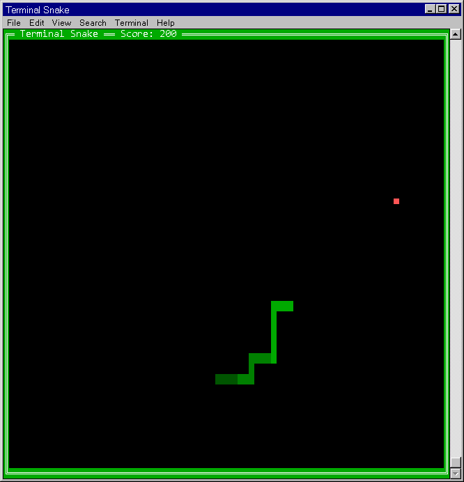
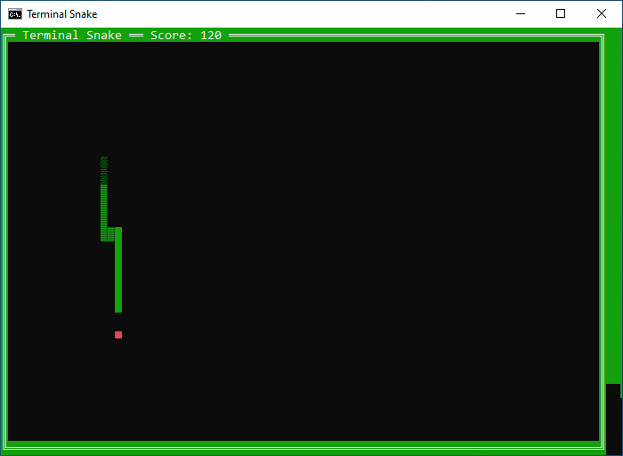
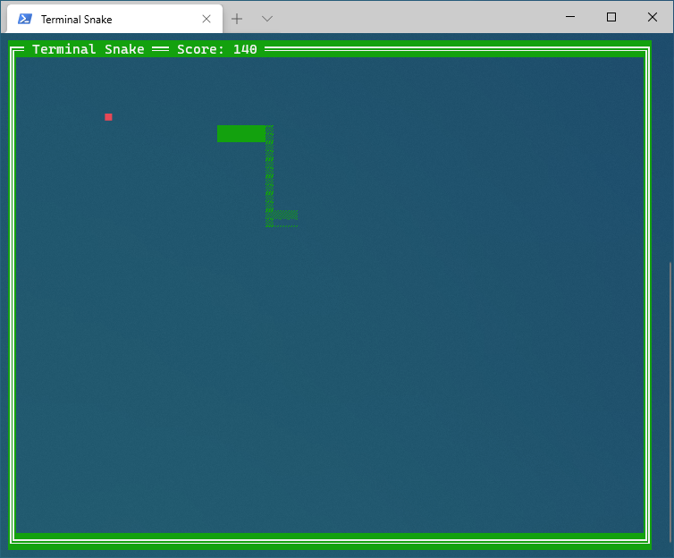

# terminal_snake
A cross-platform C# implementation of snake built to run in the console.

# Controls
Key | Action
--- | ---
**🡩** | Up
**🡫** | Down
**🡨** | Left
**🡪** | Right
**ESC** | Exit Game
**P** | Pause
**F** | Show FPS Counter

# Running The Game
The game is currently built on .NET 5.0; to run the project directly, use `dotnet run` in the project directory.

Otherwise, use prebuilt binaries provided under tags/releases.

The gameplay area defaults to the initial window size, so adjust the terminal window to the desired size before starting the game.

# Screenshots
Gameplay On Linux /w GNOME Terminal

Gameplay On Windows /w cmd.exe

Gameplay On Windows /w Windows Terminal
